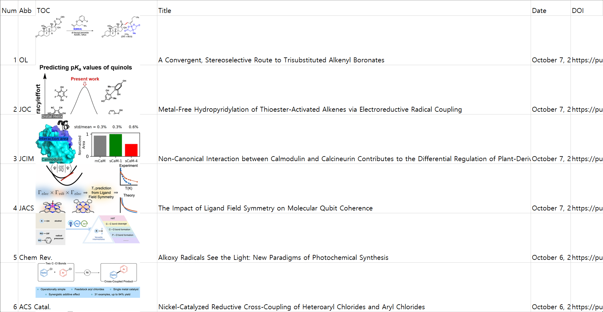
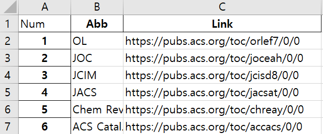

# **ACS Journal Crawler v1.1**
## **Easy to subscribe** and follow-up the information of latest articles  
Crawling the ASAP journals (ACS only supported)  
https://pubs.acs.org/

---
### How to Use
1. Enter the journal information in journal_url.xlsx file

2. Run asap.py
3. Enter the number of journal
4. Review and Enjoy the "summary.xlsx" 

---

### Lib installation
>     pip install selenium  
>     pip install pandas  
>     pip install bs4  
>     pip install requests  
>     

### The version of Chromedriver and Chrome browser must be matched (v94)  
download chromedriver
> https://chromedriver.storage.googleapis.com/index.html?path=94.0.4606.61/
