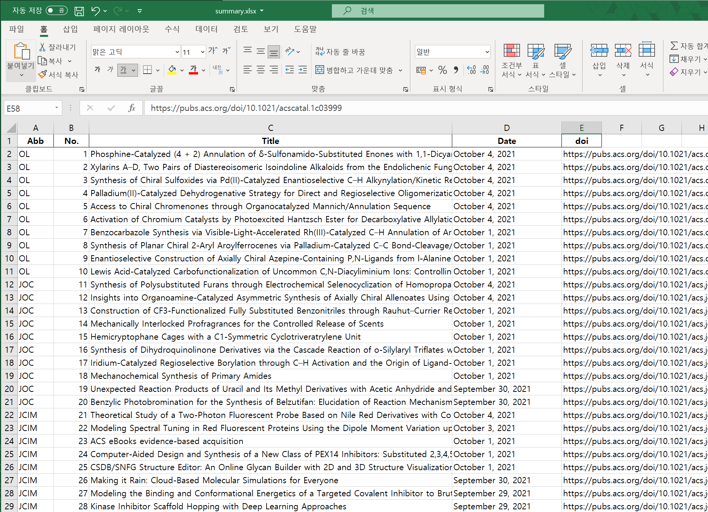

# JournalASAP
Crawling the ASAP journals

### How to Use
1. Enter the journal information in journal_url.xlsx file

3. Run asap.py
4. Enter the number of journal
5. Review and Enjoy the "summary.xlsx" 
